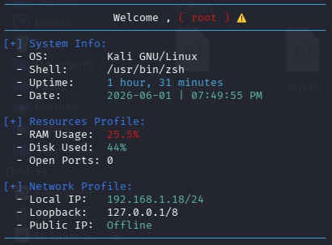

<div align="center">

# Automations_Bash

**Small Bash and Python toolkits for the repetitive parts of running a server estate.**

[](./LICENSE)

</div>

---

## Why this exists

Most of what an administrator does in a week is not administration, it is the
same twenty commands copied again. This repository is where I keep the ones
worth reusing, so they are written once, kept readable, and tested before they
touch anything that matters.

Everything here is deliberately small and dependency-free. If a script needs a
package install to run, it does not belong here.

## Status

I am not going to pad this with a roadmap. Here is exactly what is in the
repository right now:

| Module | Status | What it does |
| :--- | :--- | :--- |
| [`whoami/`](./whoami) | Working | System and network diagnostics in one pass |

That is the whole suite at the moment. If I add more modules they will be listed
in this table as they land, not before.

---

## `whoami` — System Monitor and Information Script

A single-pass Bash script that prints the state of the machine and its network
position, colour-coded, in one screen. Useful as a first command when picking up
an unfamiliar server, and as a quick sanity check before and after a change.

### What it reports

| Section | Detail |
| :--- | :--- |
| **Welcome** | Current user, and flags when running as `root` |
| **System** | OS name, shell, uptime, current date and time |
| **Resources** | RAM consumption, disk usage on `/` with a warning above 90% |
| **Network** | Local IP, loopback IP, and public IP |
| **Ports** | Count of listening TCP/UDP sockets |

That is ten distinct values across the five sections.

### Requirements

Bash, plus the utilities it calls. All are standard on any mainstream Linux
distribution.

- `coreutils` — `free`, `df`, `date`, `uptime`
- `iproute2` — `ip`, `ss`
- `curl` — optional, only for the public IP lookup. Without it the script prints
  `Offline` for that one line and carries on.
- Running as `root` lets `ss` resolve process names against the listening ports.
  Without it you still get the count, just not the owning process.

### Install and run

```bash
git clone https://github.com/omargablx02/Automations_Bash.git
cd Automations_Bash/whoami
chmod +x whoami.sh
./whoami.sh
```

You can also copy just the `whoami/` folder onto a server on its own. It has no
dependency on anything else in the repository.

### Example output

```
--------------------------------------------------
                  Welcome , omar!
--------------------------------------------------
[+] System Info:
  - OS:         Ubuntu
  - Shell:      /bin/bash
  - Uptime:     4 days, 7 hours
  - Date:       2026-10-05 | 05:12:44 PM
[+] Resources Profile:
  - RAM Usage:  23.4%
  - Disk Used:  41%
  - Open Ports: 12
[+] Network Profile:
  - Local IP:   192.168.1.24/24
  - Loopback:   127.0.0.1/8
  - Public IP:  197.x.x.x
--------------------------------------------------
```



### A note on the public IP lookup

The script calls `ifconfig.me` to resolve the public IP, with a two second
timeout. That is one outbound HTTP request to a third party. On a server with
strict egress rules, or anywhere you do not want the request at all, remove or
comment out that line. Nothing else depends on it.

---

## Contributing

Issues and pull requests are welcome. Two ground rules:

1. Test on a machine you can afford to break first.
2. Keep it dependency-free, and keep the output readable by a human who has
   never seen your scripts before.

## Connect with me

- **GitHub:** [@omargablx02](https://github.com/omargablx02)
- **LinkedIn:** [in/omar-gablx02](https://www.linkedin.com/in/omar-gablx02)
- **Portfolio:** [omargablx02.github.io/portfolio](https://omargablx02.github.io/portfolio/)

## License

MIT. See [LICENSE](./LICENSE).
